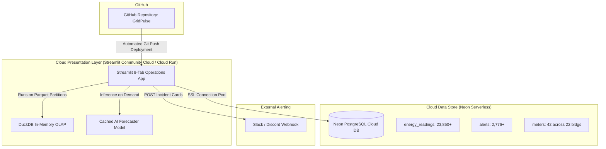
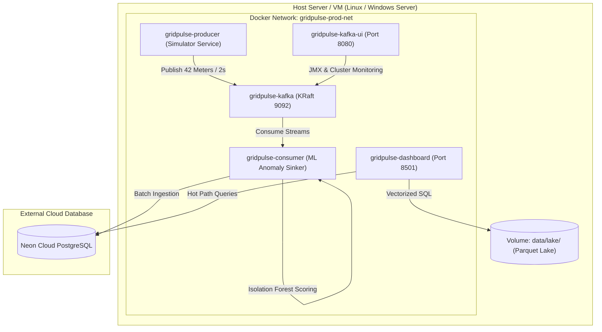

# GridPulse — Production Deployment Plan & Runbook

This document is the official deployment guide and architectural operational runbook for **GridPulse (Smart Campus IoT Energy Telemetry, Lakehouse & AI Dispatch Platform)**.

---

## 1. Executive Summary

GridPulse is architected with a decoupled, hybrid-path architecture:
- **Hot Path (Real-Time Ingestion & Analytics)**: Confluent Kafka (KRaft), Spark Structured Streaming, and **Neon Serverless PostgreSQL**.
- **Cold Path (Analytical Lakehouse)**: Partitioned Snappy Parquet data lake queried via an in-process vectorized **DuckDB OLAP** engine.
- **Predictive AI Layer**: Pre-trained 24-hour ahead recursive **Random Forest Regressor** ($MAE = 71.82\text{ kW}$, $R^2 = 0.963$) with dynamic 95% confidence bands ($\pm 1.96 \times \text{RMSE}$).
- **Automated Dispatch**: 3-Tier Peak Shaving Rules Engine linked to external webhook incident dispatching (Slack, Discord, MS Teams, SCADA sinks).
- **Visualization Tier**: Comprehensive 9-tab **Streamlit Operations Portal**.

Because the relational database is already hosted in the cloud on **Neon Serverless PostgreSQL**, deployment can be executed either as a **Serverless Web Application** (instant public URL) or a **Full-Stack Containerized Suite** (on-premise or cloud VM).

---

## 2. Deployment Architecture Options

### Option A: Cloud Serverless Deployment (Fastest / Public Showcase)
Ideal for project presentations, professors, remote evaluations, and non-technical stakeholders who need an instant web link with zero local dependencies.



### Option B: Full-Stack Containerized Deployment (On-Premise / Campus VM / AWS EC2)
Ideal for campus IT data centers, private clouds, or staging environments where local Kafka streaming and real-time producers run continuously.



---

## 3. Pre-Deployment Checklist

Before deploying, ensure the following prerequisites are met:

| Check | Item | Requirement | Status |
| :---: | :--- | :--- | :---: |
| 1 | **Cloud Database** | Active Neon PostgreSQL database instance | **Configured & Online** |
| 2 | **Database Data** | 23,850+ historical readings and 42 meters seeded | **Populated** |
| 3 | **Cold Data Lake** | Snappy Parquet files in `data/lake/raw_telemetry/` | **18,522 Records Hydrated** |
| 4 | **AI Model Cache** | Serialized model file `analysis/forecaster_model.joblib` | **Trained & Saved** |
| 5 | **Test Suite** | 14/14 automated unit & pipeline tests passing | **Verified (1.088s)** |
| 6 | **Environment File** | `.env` configured with valid credentials | **Verified** |

---

## 4. Step-by-Step Deployment Instructions

### Method 1: Instant Cloud Web Deployment (Streamlit Community Cloud)

1. **Push to GitHub**:
   Ensure all local changes are committed and pushed to your GitHub repository:
   ```bash
   git add .
   git commit -m "feat: complete Phase 5 Lakehouse and Phase 6 AI Dispatch platform"
   git push origin main
   ```

2. **Connect to Streamlit Cloud**:
   - Navigate to [share.streamlit.io](https://share.streamlit.io/) and log in with your GitHub account.
   - Click **"New app"**.
   - Select your repository (`GridPulse`), branch (`main`), and set the main file path to:
     ```
     dashboard/app.py
     ```

3. **Configure Secrets**:
   - In the Streamlit Cloud deployment modal, click **"Advanced settings..."** > **"Secrets"**.
   - Paste your Neon Database URL and alert settings:
     ```toml
     DATABASE_URL = "postgresql://neondb_owner:<your-password>@<your-neon-host>/neondb?sslmode=require"
     ALERT_WEBHOOK_URL = "https://hooks.slack.com/services/YOUR/WEBHOOK/URL"
     ```

4. **Deploy**:
   - Click **"Deploy!"**.
   - Streamlit will automatically install dependencies from `requirements.txt`, launch the container, and provide a secure public URL (e.g. `https://gridpulse.streamlit.app`).

---

### Method 2: 1-Click Automated Local / VM Deployment

Two cross-platform scripts are provided in the project root to automate pre-flight validation and startup:

#### For Windows (PowerShell):
```powershell
.\deploy.ps1
```

#### For Linux / macOS:
```bash
chmod +x deploy.sh
./deploy.sh
```

**What the deployment script does automatically:**
1. Verifies that Docker and Docker Compose are installed and running.
2. Checks `.env` and validates connectivity to the Neon cloud database.
3. Executes the 14-test suite (`python -m unittest discover -s tests`) to guarantee zero regressions.
4. Builds the production Docker image for the dashboard.
5. Launches all containers via `docker-compose.prod.yml`.
6. Performs an HTTP health check on `http://localhost:8501/_stcore/health`.
7. Outputs the live service dashboard URLs.

---

### Method 3: Manual Docker Compose Production Stack

To build and run the production stack manually:

1. **Verify Environment**:
   Ensure `.env` exists in the project root with your database credentials.

2. **Build and Launch**:
   ```bash
   docker-compose -f docker-compose.prod.yml up --build -d
   ```

3. **Verify Container Health**:
   ```bash
   docker-compose -f docker-compose.prod.yml ps
   ```
   Expected running services:
   - `gridpulse-kafka` (Up, healthy)
   - `gridpulse-kafka-ui` (Up, healthy on port 8080)
   - `gridpulse-dashboard` (Up, healthy on port 8501)

4. **Access the Interfaces**:
   - **Streamlit Operations Portal**: [http://localhost:8501](http://localhost:8501)
   - **Kafka Management UI**: [http://localhost:8080](http://localhost:8080)

5. **Stop / Teardown**:
   ```bash
   docker-compose -f docker-compose.prod.yml down
   ```

---

## 5. Continuous Integration & Delivery (CI/CD)

The repository includes a GitHub Actions workflow configured at [`.github/workflows/ci-cd.yml`](file:///d:/SEM%207/IOTBD/GridPulse/.github/workflows/ci-cd.yml).

Every `git push` or `pull request` to the `main` branch triggers an automated pipeline that:
1. Provisions an Ubuntu Linux test runner with Python 3.11.
2. Installs all production dependencies from `requirements.txt`.
3. Runs the complete test suite:
   - `test_simulator.py` (Meter generation, campus infrastructure)
   - `test_lakehouse.py` (Parquet schema, DuckDB query execution)
   - `test_forecasting.py` (Lag matrices, recursive forecasting, CI interval logic)
   - `test_dispatch.py` (3-tier peak shaving rules, tariffs, incident payload formatting)
4. Validates Streamlit compilation and module imports.
5. Tests Docker build sanity to ensure container images build cleanly without errors.

---

## 6. Verification & Post-Deployment Smoke Tests

Execute these autonomous smoke tests after deploying to verify system integrity:

### Test 1: Cloud Database Connectivity
```bash
python -c "from database.db import get_db_stats; print(get_db_stats())"
```
*Expected Output*: Displays 22 buildings, 42 meters, 23,000+ readings, 2,700+ alerts.

### Test 2: DuckDB Lakehouse OLAP Scan
```bash
python -c "from analysis.lake_analytics import query_lake; print(query_lake('SELECT COUNT(*) as total_rows FROM telemetry_lake'))"
```
*Expected Output*: Returns `total_rows: 18522` in $\approx 5\text{ ms}$.

### Test 3: AI Forecaster & Dispatch Engine
```bash
python -c "from analysis.dispatch_engine import evaluate_peak_shaving_dispatch; print(evaluate_peak_shaving_dispatch(1000.0, 850.0))"
```
*Expected Output*: Returns 3-tier dispatch directives, BESS injection schedule, and tariff penalty avoidance calculations.

### Test 4: Dashboard Healthcheck Endpoint
```bash
curl -I http://localhost:8501/_stcore/health
```
*Expected Output*: `HTTP/1.1 200 OK`.

---

## 7. Operational Troubleshooting

| Symptom | Probable Cause | Resolution |
| :--- | :--- | :--- |
| **Streamlit shows "Database Offline"** | Neon serverless compute endpoint paused or bad connection string. | Ensure `?sslmode=require` is appended to `DATABASE_URL`. Neon unpauses automatically upon first query within 3–5 seconds. |
| **Kafka producer returns `POLLHUP`** | KRaft broker is initializing leader election. | Allow 10–15 seconds for KRaft quorum to stabilize; retries are built into `get_kafka_producer(retries=3)`. |
| **DuckDB returns empty table** | Lakehouse path empty or unmounted. | Verify Parquet partitions exist in `data/lake/raw_telemetry/` or execute `python simulator/lake_exporter.py` to regenerate. |
| **Port 8501 or 8080 already in use** | Another local process bound to the port. | Override port via environment variable: `STREAMLIT_SERVER_PORT=8502` or terminate the conflicting process. |

---

## 8. Summary of Deployment Files

| File | Purpose |
| :--- | :--- |
| [`Dockerfile`](file:///d:/SEM%207/IOTBD/GridPulse/Dockerfile) | Production container definition for the Streamlit dashboard. |
| [`.dockerignore`](file:///d:/SEM%207/IOTBD/GridPulse/.dockerignore) | Prevents local cache, virtualenvs, and temporary files from bloating the Docker image. |
| [`docker-compose.prod.yml`](file:///d:/SEM%207/IOTBD/GridPulse/docker-compose.prod.yml) | Multi-container production stack (Kafka, Kafka-UI, Dashboard). |
| [`deploy.ps1`](file:///d:/SEM%207/IOTBD/GridPulse/deploy.ps1) | 1-Click deployment script for Windows environments. |
| [`deploy.sh`](file:///d:/SEM%207/IOTBD/GridPulse/deploy.sh) | 1-Click deployment script for Linux and macOS environments. |
| [`.github/workflows/ci-cd.yml`](file:///d:/SEM%207/IOTBD/GridPulse/.github/workflows/ci-cd.yml) | GitHub Actions CI/CD automation pipeline. |
| [`requirements.txt`](file:///d:/SEM%207/IOTBD/GridPulse/requirements.txt) | Dependency manifest with pinned production packages. |
