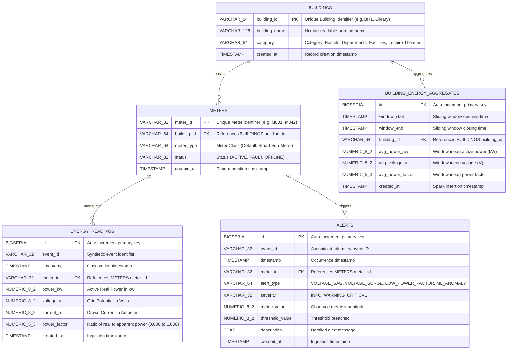
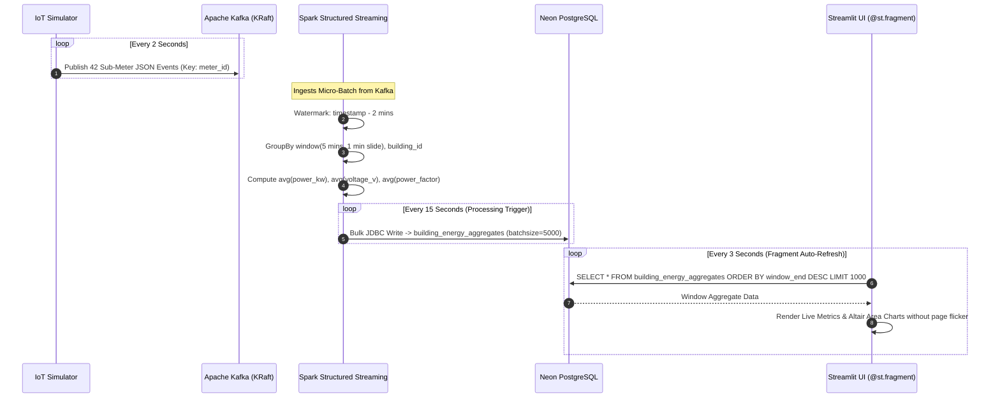
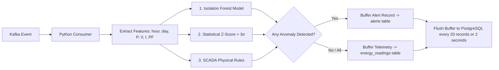
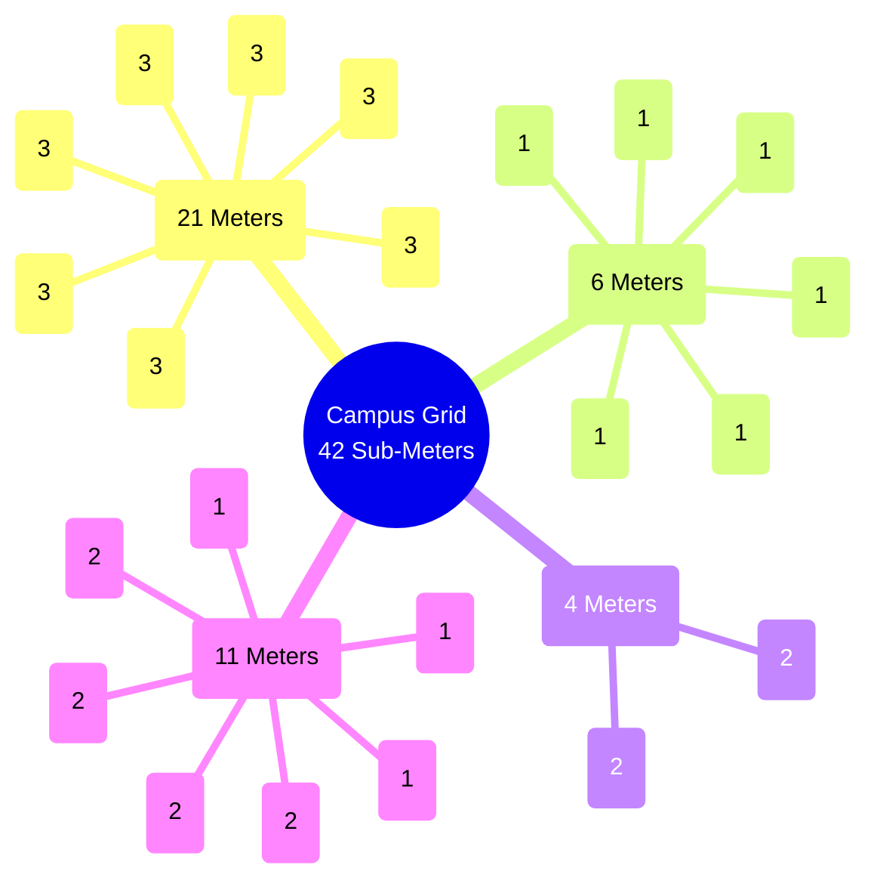
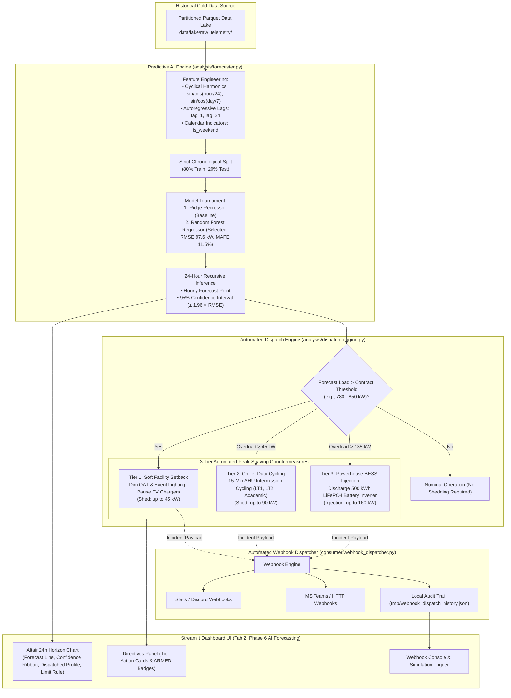

# ⚡ GridPulse: System Architecture & Technical Design Document

## 1. Executive System Overview

**GridPulse** is an enterprise-grade IoT data pipeline and real-time analytics platform engineered to monitor, analyze, and detect anomalies across a distributed university campus power grid.

The platform processes high-frequency electrical telemetry generated across **42 smart sub-meters** distributed throughout **19 campus buildings** (comprising Student Hostels, Academic Departments, Lecture Theatres, and Shared Campus Facilities).

### Core Architectural Philosophy
GridPulse implements a modern **hybrid streaming-first architecture** (combining elements of Kappa and Lambda patterns):
1. **Decoupled Ingestion Layer:** High-throughput, persistent event streaming via **Apache Kafka (KRaft mode)** decouples sensor producers from downstream processors.
2. **Distributed Micro-Batch Stream Processing:** **Apache Spark Structured Streaming (PySpark)** handles real-time windowed aggregations and watermarking over streaming telemetry.
3. **Dual Storage Architecture:**
   - **Hot / Serving Store (PostgreSQL on Neon):** Stores 3NF normalized dimensions, time-series facts, threshold/ML alerts, and sliding-window aggregates for fast OLTP and dashboard queries.
   - **Cold / Data Lake Store (Apache Parquet):** Stores raw partitioned columnar files (`year/month/day`) for scalable historical analytics, data science, and long-term compliance.
4. **Multi-Tier Machine Learning Anomaly Detection:** Combines unsupervised machine learning (**Scikit-Learn Isolation Forest**), dynamic statistical baseline deviations (**$Z$-Scores**), and deterministic **SCADA physical electrical guardrails**.
5. **Zero-Flicker Interactive Real-Time UI:** **Streamlit** dashboard leveraging `@st.fragment` partial DOM re-rendering for sub-second live updates without page redraw overhead.

---

## 2. End-to-End System Architecture Diagram

```mermaid
flowchart TB
    subgraph SENSORS ["📡 Telemetry Generation Layer"]
        Sim["IoT Campus Simulator<br/>(simulator/simulator.py)<br/>42 Smart Sub-Meters"]
        KP["Kafka Producer Client<br/>(simulator/kafka_producer.py)<br/>confluent-kafka (Key: meter_id)"]
        Sim --> KP
    end

    subgraph BROKER ["⚡ Event Ingestion & Message Broker (Docker)"]
        KAFKA["Apache Kafka Broker 7.6.0 (KRaft Mode)<br/>Port 9092 (Host) / 29092 (Docker)<br/>Topic: gridpulse.telemetry.raw"]
        KUI["Kafka UI (Provectus)<br/>Port 8080 (Web Interface)"]
        KP -->|JSON Events| KAFKA
        KAFKA -.-> KUI
    end

    subgraph PROCESSING ["⚙️ Distributed Stream & Anomaly Processing"]
        subgraph SPARK ["Apache Spark 3.5.0 (Docker Container: spark-processor)"]
            SP["Spark Structured Streaming<br/>(stream_processor/spark_processor.py)<br/>Watermark: 2 min | Window: 5 min / 1 min slide"]
        end
        subgraph WORKER ["Python Anomaly Worker"]
            KC["Kafka Consumer Client<br/>(consumer/consumer.py)"]
            ML["Hybrid ML Anomaly Engine<br/>(analysis/ml_anomaly_detector.py)<br/>Isolation Forest + Z-Score + SCADA"]
            KC --> ML
        end
        KAFKA -->|Kafka Source Stream| SP
        KAFKA -->|Consumer Group Stream| KC
    end

    subgraph STORAGE ["💾 Storage & Serving Layer"]
        subgraph NEON ["Cloud Relational Database (Neon PostgreSQL)"]
            T_BLD["buildings (Dimension)"]
            T_MET["meters (Dimension)"]
            T_READ["energy_readings (Fact / History)"]
            T_ALR["alerts (Anomalies & Events)"]
            T_AGG["building_energy_aggregates (Stream Aggregates)"]
        end
        subgraph LAKE ["Columnar Data Lake (Cold Path)"]
            PARQUET["Parquet Files<br/>data/lake/raw_telemetry/<br/>Partitioned by year/month/day"]
        end
        SP -->|JDBC Micro-Batch Write<br/>Trigger: 15s, Batch: 5000| T_AGG
        SP -->|Parquet Stream Append<br/>Trigger: 30s| PARQUET
        KC -->|Buffered Telemetry & ML Alerts| T_READ
        KC -->|Buffered Telemetry & ML Alerts| T_ALR
    end

    subgraph PRESENTATION ["📊 Real-Time Analytics & UI"]
        DASH["Streamlit Dashboard Application<br/>(dashboard/app.py)"]
        FRAG["Real-Time Live View Fragment<br/>@st.fragment(run_every='3s')"]
        TABS["Multi-Day Trends • 24h Diurnal Curves •<br/>Infrastructure • Alerts • Schema • SQL Explorer"]
        DASH --- FRAG
        DASH --- TABS
        T_AGG -->|Fast Polling (Window End DESC)| FRAG
        T_READ -->|SQL Pushdown Queries| TABS
        T_ALR -->|SQL Pushdown Queries| TABS
        T_BLD -->|SQL Dimensions Join| TABS
        T_MET -->|SQL Dimensions Join| TABS
    end
```

---

## 3. Deep-Dive Directory & Component Structure

```text
d:/SEM 7/IOTBD/GridPulse/
├── .env                               # Cloud database credentials & service configurations
├── .gitignore                         # Git tracking exclusions (.venv, __pycache__, data files)
├── docker-compose.yml                 # KRaft Kafka Broker & Kafka-UI service definitions
├── readme.md                          # Quickstart guide and Phase 4 execution instructions
├── requirements.txt                   # Production Python package dependencies
├── run_spark.ps1                      # Powershell runner for Dockerized Spark Structured Streaming
│
├── analysis/                          # Analytical computation & Machine Learning modules
│   ├── analysis.py                    # KPIs, aggregations, time-series profiles, SQL DataFrame queries
│   ├── lake_analytics.py              # In-process DuckDB columnar SQL engine & partition pruning
│   └── ml_anomaly_detector.py         # Isolation Forest, Z-Score, and physical SCADA anomaly engine
│
├── consumer/                          # Decoupled streaming ingestion clients
│   └── consumer.py                    # Kafka Consumer with real-time ML anomaly scoring & DB buffer sink
│
├── dashboard/                         # Presentation tier
│   └── app.py                         # Streamlit multi-tab web application with live fragments & Lakehouse Explorer
│
├── data/                              # Local persistent storage & file-based caches
│   ├── lake/                          # Spark Data Lakehouse root (Parquet files & checkpoints)
│   │   ├── checkpoints/               # Spark streaming checkpoint metadata
│   │   └── raw_telemetry/             # Partitioned Parquet telemetry store (year/month/day)
│   ├── processed/                     # Enriched CSV files (apparent & reactive power)
│   └── raw/                           # Raw fallback CSV telemetry generated by batch simulator
│
├── database/                          # Relational schema & persistence layer
│   └── db.py                          # SQLAlchemy engine, connection pooling, 3NF DDL, and SQL queries
│
├── docs/                              # Formal system documentation
│   ├── design.md                      # System architecture & technical design specification
│   └── phases.md                      # Project evolutionary phases, milestones & roadmap
│
├── kafka/                             # Kafka configurations & legacy stubs
│   └── docker-compose.yml             # Sub-directory docker compose stub
│
├── scripts/                           # Maintenance & storage optimization routines
│   └── compact_lake.py                # Micro-batch small-file compaction utility for Parquet lake
│
├── simulator/                         # Synthetic IoT telemetry generation engine
│   ├── kafka_producer.py              # High-velocity Kafka producer streaming real-time JSON events
│   ├── lake_exporter.py               # Direct Parquet lake hydration engine from batch CSV/simulations
│   └── simulator.py                   # Campus physics engine, diurnal load curves & batch historical generator
│
├── tests/                             # Automated unit & integration tests
│   └── test_simulator.py              # Unit tests for electrical calculations & campus configurations
│
└── tmp/                               # Scratch space for intermediate Docker execution
```

### Module Responsibilities & Key Functions

| Component | File Path | Primary Function & Responsibilities |
| :--- | :--- | :--- |
| **IoT Simulator** | [`simulator/simulator.py`](file:///d:/SEM%207/IOTBD/GridPulse/simulator/simulator.py) | Generates synthetic campus telemetry based on mathematical models of academic and residential routines. Functions: `create_meters()`, `calculate_building_power()`, `generate_reading()`, `generate_historical_batch()`. |
| **Kafka Producer** | [`simulator/kafka_producer.py`](file:///d:/SEM%207/IOTBD/GridPulse/simulator/kafka_producer.py) | Uses `confluent-kafka` to serialize readings to JSON, keys records by `meter_id`, and asynchronously transmits them to Kafka topic `gridpulse.telemetry.raw`. |
| **Spark Processor** | [`stream_processor/spark_processor.py`](file:///d:/SEM%207/IOTBD/GridPulse/stream_processor/spark_processor.py) | Distributed stream processor. Implements a 5-minute sliding window with 1-minute slide and 2-minute watermark. Sinks aggregates to PostgreSQL and raw streams to Parquet lake. |
| **Lake Exporter** | [`simulator/lake_exporter.py`](file:///d:/SEM%207/IOTBD/GridPulse/simulator/lake_exporter.py) | Hydrates partitioned Parquet data lake from historical CSVs or multi-day synthetic batches with Snappy compression and date partition hierarchy. |
| **Lake Analytics** | [`analysis/lake_analytics.py`](file:///d:/SEM%207/IOTBD/GridPulse/analysis/lake_analytics.py) | In-process columnar SQL query engine using **DuckDB** and **PyArrow**. Delivers sub-10ms queries, partition pruning, 24h diurnal profiles, and performance benchmarks. |
| **Lake Compactor** | [`scripts/compact_lake.py`](file:///d:/SEM%207/IOTBD/GridPulse/scripts/compact_lake.py) | Coalesces high-frequency streaming micro-batch Parquet files into unified daily/hourly files, solving the small-file problem. |
| **Kafka Consumer** | [`consumer/consumer.py`](file:///d:/SEM%207/IOTBD/GridPulse/consumer/consumer.py) | Independent consumer group worker. Evaluates incoming stream events against `MLAnomalyDetector` and flushes batches into PostgreSQL `energy_readings` and `alerts`. |
| **ML Detector** | [`analysis/ml_anomaly_detector.py`](file:///d:/SEM%207/IOTBD/GridPulse/analysis/ml_anomaly_detector.py) | 3-tier anomaly detector: `IsolationForest` model for contextual deviations, rolling $Z$-score ($>3\sigma$) for power spikes, and SCADA voltage/PF checks. |
| **Relational DB** | [`database/db.py`](file:///d:/SEM%207/IOTBD/GridPulse/database/db.py) | Manages PostgreSQL connection pooling, executes DDL table creation (`init_db()`), seeds dimensions (`seed_dimensions()`), bulk inserts (`execute_values`), and provides SQL join queries. |
| **Analytical Engine**| [`analysis/analysis.py`](file:///d:/SEM%207/IOTBD/GridPulse/analysis/analysis.py) | Computes grid KPIs, 24-hour hourly load profiles, weekday vs. weekend profiles, category/building summaries, and mathematical electrical conversions ($kVA, kVAR$). |
| **Dashboard** | [`dashboard/app.py`](file:///d:/SEM%207/IOTBD/GridPulse/dashboard/app.py) | Real-time Streamlit visualization app. Features live fragment polling for streaming aggregates, Phase 5 Data Lakehouse explorer, Altair charts, and alert feeds. |

---

## 4. Data Models & Database Specifications

### 4.1 Relational Data Model (Neon PostgreSQL 3NF)



### 4.2 Indexing & Query Optimization Strategy

| Index Name | Target Table | Indexed Column(s) | Optimization Goal |
| :--- | :--- | :--- | :--- |
| `idx_readings_timestamp` | `energy_readings` | `timestamp DESC` | Accelerates recent time-window queries and range filtering. |
| `idx_readings_meter_id` | `energy_readings` | `meter_id` | Accelerates meter-level joins and aggregations. |
| `idx_readings_meter_time` | `energy_readings` | `meter_id, timestamp DESC` | Composite index for instantaneous meter snapshot queries (`ORDER BY timestamp DESC LIMIT 1`). |
| `idx_alerts_timestamp` | `alerts` | `timestamp DESC` | Enables fast retrieval of latest grid anomalies and alert feeds. |
| `idx_alerts_meter_id` | `alerts` | `meter_id` | Supports alert correlation per meter. |
| `idx_aggregates_window` | `building_energy_aggregates` | `window_end DESC` | Powers sub-second dashboard polling for the latest sliding-window values. |

### 4.3 Kafka Event Telemetry Schema

Messages published to `gridpulse.telemetry.raw`:
- **Message Key (String):** `meter_id` (e.g. `"M001"`, `"M015"`).
  - *Keying Rationale:* Kafka guarantees strict total ordering within a single partition. Keying by `meter_id` ensures that all telemetry for a given sub-meter is routed to the exact same partition, preserving temporal sequence.
- **Message Value (JSON Payload):**
```json
{
  "event_id": "E1718290123",
  "timestamp": "2026-09-07T14:30:00",
  "meter_id": "M001",
  "building_id": "BH1",
  "building_type": "Hostels",
  "power_kw": 28.45,
  "voltage_v": 231.12,
  "current_a": 123.11,
  "power_factor": 0.942
}
```

### 4.4 Data Lake (Parquet) Columnar Partitioning Schema

Raw telemetry written by Spark Structured Streaming:
```text
data/lake/raw_telemetry/
├── year=2026/
│   ├── month=09/
│   │   ├── day=07/
│   │   │   ├── part-00000-xxxx.c000.snappy.parquet
│   │   │   └── part-00001-xxxx.c000.snappy.parquet
```
- **Compression:** Snappy compression format.
- **Pruning:** Predicate pushdown allows analytical engines (DuckDB, Trino, PySpark) to skip irrelevant dates without reading petabytes of unneeded raw files.

---

## 5. Telemetry Ingestion, Streaming & Analytical Pipelines

### 5.1 Hot Path: Spark Sliding Window Stream Processing



### 5.2 Warm Path: Real-Time Machine Learning Anomaly Detection



### 5.3 Cold Path: Parquet Lakehouse Archival & Columnar Analytics

```mermaid
flowchart TD
    subgraph INGEST ["1. Cold-Path Ingestion"]
        K[Kafka Raw Stream] --> S[Spark Structured Streaming]
        CSV[Batch CSV / Simulator] --> LE[Lake Exporter Engine<br/>simulator/lake_exporter.py]
        S --> E[Add Date Dimensions: year, month, day]
        E --> CHK[Checkpoint to data/lake/checkpoints/]
        CHK --> SNK[Parquet Append (30s Trigger)]
        LE --> SNK
    end

    subgraph LAKE_STORE ["2. Partitioned Columnar Lake"]
        SNK --> LAKE["Snappy Parquet Store<br/>data/lake/raw_telemetry/year=YYYY/month=MM/day=DD/"]
        CMP["Compaction Engine<br/>scripts/compact_lake.py"] -.->|Coalesce Micro-Batches| LAKE
    end

    subgraph QUERY ["3. Cold-Path Serving & Vectorized Analytics"]
        LAKE --> DUCK["DuckDB SQL Query Engine<br/>analysis/lake_analytics.py<br/>Partition Pruning & Vectorized Execution"]
        DUCK --> BENCH["Performance Benchmark<br/>(Sub-10ms Queries, 448x Faster than SQL Joins)"]
        DUCK --> UI["Streamlit Tab 1: Phase 5 Data Lakehouse<br/>Diurnal Profiles, Building Aggregates, Ad-Hoc Explorer"]
    end
```

---

## 6. Physics, Behavioral Curves & Domain Modeling

### 6.1 Campus Infrastructure Mapping (42 Sub-Meters across 19 Buildings)



### 6.2 Diurnal Simulation Curves & Scheduling Logic

The simulation engine models authentic institutional power dynamics:

1. **Departments & Lecture Theatres:**
   - **Active Academic Hours:** Weekdays 8:30 AM to 6:30 PM.
   - **Load Profile:** Modeled via a half-wave sinusoidal curve:
     $$P(t) = P_{\text{base}} + P_{\text{peak}} \cdot \sin\left(\frac{t - 8.5}{10} \cdot \pi\right) + \epsilon$$
     Where $\epsilon \sim \mathcal{U}(-2, 3)$ kW represents instantaneous appliance variation.
   - **Night & Weekend Off-Hours:** Drops to base standby load ($3.5 - 7.5$ kW).
2. **Student Hostels:**
   - **Bimodal Daily Peaks:** Morning preparation peak (6:00 AM – 9:00 AM, $20 - 32$ kW) and evening/night study and entertainment peak (5:30 PM – Midnight, $22 - 36$ kW).
   - **Midday Lull:** Weekday daytime drops significantly ($7 - 13$ kW) as students attend lectures.
   - **Weekend Sustained Load:** Elevated usage throughout daytime ($18 - 32$ kW).
3. **Campus Facilities Specific Constraints:**
   - **Central Library:** Full operations Monday to Saturday (8:00 AM – 10:00 PM, up to $36$ kW). **Closed on Sundays:** Standby idling power drops to $1.5 - 3.5$ kW (visually highlighted in red on dashboard analytics).
   - **Cafeteria:** Trimodal surges corresponding to meals: Breakfast (7:00 – 9:30 AM), Lunch (12:00 – 2:30 PM), Dinner (7:00 – 10:00 PM).
   - **Main Powerhouse:** Constant critical infrastructure load ($38 - 55$ kW).

### 6.3 Electrical Physics Calculations

- **Active Real Power ($P$):** Computed in Kilowatts (kW) via behavioral curves.
- **Supply Voltage ($V$):** Nominal $230V$ with inverse voltage sag relative to load:
  $$V = 233.0 - \left(\frac{P}{50.0}\right) \cdot 4.0 + \mathcal{N}(0, 2.5)$$
- **Drawn Current ($I$):** Derived using single-phase alternating current power formula:
  $$I = \frac{P \times 1000}{V} \quad [\text{Amperes}]$$
- **Power Factor ($PF$):** Varies by building inductive load:
  - Facilities & Departments (HVAC compressors, lab inductive motors): $0.86 - 0.95$.
  - Hostels (resistive lighting, electronics): $0.90 - 0.98$.
- **Apparent Power ($S$) & Reactive Power ($Q$):**
  $$S = \frac{P}{PF} \quad [\text{kVA}], \qquad Q = \sqrt{\max\left(0, S^2 - P^2\right)} \quad [\text{kVAR}]$$

---

## 7. Machine Learning & Anomaly Detection Architecture

GridPulse deploys a **Three-Tier Hybrid Anomaly Engine** ([`analysis/ml_anomaly_detector.py`](file:///d:/SEM%207/IOTBD/GridPulse/analysis/ml_anomaly_detector.py)):

### Layer 1: Unsupervised Machine Learning (`IsolationForest`)
- **Algorithm:** Scikit-Learn `IsolationForest` with $100$ isolation trees, $2\%$ contamination factor, and multithreading (`n_jobs=-1`).
- **Feature Vector:** $X = [\text{hour}, \text{day\_of\_week}, \text{power\_kw}, \text{voltage\_v}, \text{current\_a}, \text{power\_factor}]$.
- **Purpose:** Identifies multidimensional contextual anomalies that simple static thresholds fail to catch (e.g., $40$ kW load drawn at 3:00 AM on Sunday in an academic building).
- **Inference Metric:** Negative decision function scores denote anomalous points.

### Layer 2: Statistical Dynamic Baseline ($Z$-Score)
- **Algorithm:** Per-meter rolling mean ($\mu_m$) and standard deviation ($\sigma_m$) computed across historical normal operational periods.
- **Formula:**
  $$Z = \frac{P_{\text{observed}} - \mu_m}{\sigma_m}$$
- **Condition:** Flags any load surge exceeding 3 standard deviations ($|Z| > 3.0$).

### Layer 3: Deterministic SCADA Electrical Guardrails
- Implements strict IEEE 1159 / IEC power quality standards:
  - **Voltage Sag:** $V < 220.0$ V (causes motor stall and brownouts; classified as `CRITICAL`).
  - **Voltage Surge:** $V > 240.0$ V (causes transformer insulation stress; classified as `WARNING`).
  - **Low Power Factor:** $PF < 0.88$ (triggers utility penalty and excessive inductive losses; classified as `WARNING`).

---

## 8. Distributed Processing & Performance Optimizations

### 8.1 Spark Streaming Optimizations
- **Watermarking for Late Data:** `.withWatermark("timestamp", "2 minutes")` enables the stateful streaming engine to bound memory usage and drop obsolete events arriving beyond a 2-minute latency threshold.
- **Tuned Micro-Batch Triggers:** `.trigger(processingTime="15 seconds")` balances sub-meter data freshness against database connection exhaustion.
- **JDBC Write Pooling:**
  - `batchsize = 5000`: Batches multi-row INSERT statements in memory before issuing single network packets to PostgreSQL.
  - `isolationLevel = NONE`: Disables distributed transaction locking across worker tasks, maximizing micro-batch append throughput.

### 8.2 Streamlit Rendering Optimizations
- Traditional Streamlit applications re-execute the entire script from top to bottom on every data update, causing UI flickering and chart stutter.
- GridPulse leverages `@st.fragment(run_every="3s")` on `realtime_streaming_view()`:
  - Only the inner DOM container polling `building_energy_aggregates` is recalculated every 3 seconds.
  - Sidebar filters, static layouts, and multi-day historical tabs remain completely untouched, delivering an instantaneous, desktop-like dashboard experience.

---

## 9. Deployment & Operations Runbook

### 9.1 Environment Configuration (`.env`)
```env
DATABASE_URL=postgresql://<user>:<password>@<neon-host>/neondb?sslmode=require
KAFKA_BOOTSTRAP_SERVERS=localhost:9092
KAFKA_TOPIC=gridpulse.telemetry.raw
```

### 9.2 Startup Sequence (Step-by-Step)

#### 1. Launch Kafka Broker & Kafka UI
```powershell
# In root directory
docker-compose up -d
```
*Verify containers `gridpulse-kafka` and `gridpulse-kafka-ui` are healthy. Access Kafka UI at `http://localhost:8080`.*

#### 2. Start IoT Telemetry Kafka Producer
```powershell
python simulator/kafka_producer.py
```
*The producer will begin publishing batches of 42 sub-meter events every 2 seconds.*

#### 3. Launch Spark Structured Streaming Job
```powershell
# Executes inside Docker to bypass local Windows JVM/Hadoop setup
.\run_spark.ps1
```
*Spark connects to `kafka:29092`, performs 5-minute sliding window aggregations, and writes to PostgreSQL.*

#### 4. Launch Streamlit Dashboard
```powershell
streamlit run dashboard/app.py
```
*Open `http://localhost:8501` and navigate to the **⚡ Phase 4: Real-Time Stream** tab to observe live metrics.*

---

## 10. Technology Stack Summary

| Layer | Component / Tool | Version / Specification | Rationale |
| :--- | :--- | :--- | :--- |
| **Language** | Python | 3.10+ | Primary language for simulation, stream coordination, ML, and dashboarding. |
| **Event Broker** | Apache Kafka | 7.6.0 (Confluent CP) | KRaft mode (no Zookeeper), high-throughput topic partitioning keyed on `meter_id`. |
| **Stream Engine** | Apache Spark | 3.5.0 (PySpark) | Distributed stateful sliding windows, 2-minute watermarking, and JDBC multi-row sink. |
| **Hot Database** | PostgreSQL | Neon Serverless | Relational integrity, 3NF schema, B-Tree indexes, and analytical SQL pushdown. |
| **Cold Data Lake** | Apache Parquet & DuckDB | Snappy Columnar / DuckDB 1.5+ | Sub-10ms serverless vectorized SQL scans over date partitions (448x speedup). |
| **Anomaly Detection** | Scikit-Learn | Isolation Forest + Z-Scores | Multi-tier unsupervised ML, dynamic statistical baseline, and SCADA guardrails. |
| **Predictive AI** | Scikit-Learn | Random Forest & Fourier Encodings | Chronologically trained 24-hour recursive load forecasting with 95% CI bands. |
| **Demand Response** | Rule Engine | 3-Tier Peak Shaving | Prescriptive HVAC duty cycling, facility setback, and BESS injection. |
| **Alert Dispatcher** | Webhook Engine | Slack / Discord / HTTP JSON | Asynchronous incident card delivery for peak breaches and critical SCADA faults. |
| **Presentation** | Streamlit & Altair | Modern Fragment API | Zero-flicker live streaming view, Lakehouse Explorer, and AI Dispatch console. |
| **Orchestration** | Docker Compose | Compose v2 | Containerized KRaft Kafka, Kafka-UI, and Dockerized Spark runner. |

---

## 11. Phase 6: Predictive AI & Automated Dispatch Architecture


