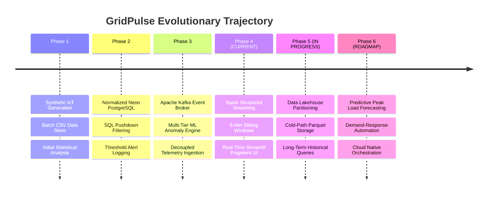

# ⚡ GridPulse: Architectural Phases & Roadmap

This document outlines the evolutionary phases of the **GridPulse Smart Campus Energy Monitoring & Analytics Platform**, detailing the current operational state, completed milestones, active implementations, and future roadmap.

---

## 📍 Current Status: Where We Are

> ### **Current Active Phase: Phase 4 (Event Streaming & Real-Time Analytics)**
> **Status:** **Fully Implemented & Operational**  
> **Transitioning Into:** **Phase 5 (Data Lakehouse & Parquet Archival - In Progress)**

The platform has completed **Phases 1, 2, 3, and 4**. Telemetry streams continuously from the IoT simulator into an Apache Kafka broker, where Apache Spark Structured Streaming processes micro-batches with 5-minute sliding windows (1-minute slide) and sinks them into cloud PostgreSQL (Neon). The Streamlit dashboard renders live sub-second updates using isolated `@st.fragment` polling. Concurrently, initial Phase 5 logic (Parquet data lake dual-sinking) has been introduced into the Spark pipeline.

---

## 🗺️ Phases Matrix Overview

| Phase | Phase Name | Primary Stack | Status | Key Deliverable |
| :--- | :--- | :--- | :---: | :--- |
| **Phase 1** | **Batch CSV & Synthetic Telemetry** | Python, Pandas, NumPy, CSV | **Completed** | 42-meter campus simulator, diurnal load curves, CSV data store, initial analytics |
| **Phase 2** | **Relational Data Warehouse & SQL Pushdown** | PostgreSQL (Neon), SQLAlchemy, psycopg2 | **Completed** | 3NF relational schema, indexing, SQL pushdown filters, automated threshold alerting |
| **Phase 3** | **Distributed Message Broker & ML Anomaly Ingestion** | Apache Kafka (KRaft), Scikit-Learn (Isolation Forest) | **Completed** | Decoupled event streaming (`gridpulse.telemetry.raw`), multi-tier ML anomaly detection |
| **Phase 4** | **Distributed Stream Processing & Window Analytics** | Apache Spark 3.5.0, PySpark, Docker, Streamlit Fragments | **Completed** | Sliding-window stream analytics (5m window/1m slide), 15s triggers, zero-flicker UI |
| **Phase 5** | **Data Lakehouse Storage & Cold Path Analytics** | Apache Parquet, Snappy, PySpark Structured Streaming | **In Progress** | Partitioned time-series Parquet lake (`year/month/day`), dual-write streaming sink |
| **Phase 6** | **Predictive AI, Forecasting & Automated Dispatch** | PyTorch / Prophet / LSTM, FastStream, Alert Webhooks | **Planned** | 24-hour ahead peak load forecasting, demand response dispatch, peak-shaving alerts |

---

## 🔍 Detailed Phase Breakdown



---

### 🟢 Phase 1: Local Ingestion & Synthetic Telemetry Simulation (Batch CSV)
- **Objective:** Establish the telemetry foundation by generating physically realistic campus-wide electricity consumption profiles without requiring physical sub-meters.
- **Implemented Components:**
  - **IoT Simulator Engine ([`simulator/simulator.py`](file:///d:/SEM%207/IOTBD/GridPulse/simulator/simulator.py)):**
    - Configured 42 smart sub-meters across 19 campus buildings divided into 4 categories:
      - *Hostels (7 buildings, 21 meters):* BH1, BH2, BH3, BH4, GH, IVH, Satpura (morning & night residential peaks).
      - *Departments (6 buildings, 6 meters):* Management, IT, CS, EEE, Engineering Science, GEN-LAB (bell-curve weekday academic loads).
      - *Lecture Theatres (2 buildings, 4 meters):* LT1, LT2 (intermittent lecture loads).
      - *Facilities (7 buildings, 11 meters):* Library, Cafeteria, Powerhouse, SC, OAT, Academic Block, Convention Center.
    - Implemented physical rules: Sunday Library closure (~2.5 kW standby vs ~28 kW weekday), 3-tier mealtime surges in Cafeteria, nominal 230V voltage with Gaussian jitter, current derived via $I = (P \times 1000) / V$, and power factor modeling.
  - **Batch Data Pipelines:**
    - Raw CSV sink: `data/raw/energy_data.csv`.
    - Processed CSV sink: `data/processed/processed_energy_data.csv` enriched with Apparent Power ($kVA = kW / PF$) and Reactive Power ($kVAR = \sqrt{kVA^2 - kW^2}$).
  - **Analytical Baseline ([`analysis/analysis.py`](file:///d:/SEM%207/IOTBD/GridPulse/analysis/analysis.py)):**
    - KPI computations: total power, diurnal load curves, weekday vs. weekend comparisons, and simple rule-based anomaly detection.

---

### 🟢 Phase 2: Relational Data Warehousing & SQL Pushdown (PostgreSQL / Neon)
- **Objective:** Move beyond flat CSV files into an enterprise-grade, cloud-hosted relational database capable of handling historical queries, relational integrity, and pushdown filtering.
- **Implemented Components:**
  - **Cloud Database ([`database/db.py`](file:///d:/SEM%207/IOTBD/GridPulse/database/db.py)):**
    - Connected to Serverless **Neon PostgreSQL** via connection-pooled SQLAlchemy engine (`pool_size=5`, `max_overflow=10`, `pool_pre_ping=True`).
  - **Normalized Relational Schema (3NF):**
    - `buildings` (Dimension): `building_id` (PK), `building_name`, `category`.
    - `meters` (Dimension): `meter_id` (PK), `building_id` (FK), `meter_type`, `status`.
    - `energy_readings` (Time-series Fact): `id` (BIGSERIAL PK), `event_id`, `timestamp`, `meter_id` (FK), `power_kw`, `voltage_v`, `current_a`, `power_factor`.
    - `alerts` (Anomaly Log): `id` (BIGSERIAL PK), `event_id`, `timestamp`, `meter_id` (FK), `alert_type`, `severity`, `metric_value`, `threshold_value`, `description`.
  - **Query Performance & Indexing:**
    - B-Tree indexes on `idx_readings_timestamp`, `idx_readings_meter_id`, `idx_readings_meter_time`, and `idx_alerts_timestamp`.
    - SQL pushdown query function `load_telemetry_with_joins` allowing the database engine to handle filtering, joining, and sorting before transferring data to Pandas.
  - **Threshold Anomaly Engine:**
    - Automated detection during ingestion: Voltage Sags ($<220V$), Voltage Surges ($>240V$), and Low Power Factor ($<0.88$).
  - **Interactive Multi-Tab Dashboard ([`dashboard/app.py`](file:///d:/SEM%207/IOTBD/GridPulse/dashboard/app.py)):**
    - Built comprehensive tabs for Timeline Trends, 24-Hour Curves, Infrastructure Hierarchy, Relational Schema viewer, and SQL Data Explorer with CSV export.

---

### 🟢 Phase 3: Real-Time Event Streaming & Message Broker Ingestion (Apache Kafka & ML)
- **Objective:** Decouple data generation from ingestion and storage using an event-driven publish-subscribe message broker, while upgrading anomaly detection to machine learning.
- **Implemented Components:**
  - **Containerized Apache Kafka Cluster ([`docker-compose.yml`](file:///d:/SEM%207/IOTBD/GridPulse/docker-compose.yml)):**
    - Deployed `confluentinc/cp-kafka:7.6.0` in modern **KRaft mode** (no Zookeeper overhead) exposing port `9092` (host) and `29092` (Docker internal).
    - Deployed `provectuslabs/kafka-ui:latest` on port `8080` for visual topic inspection, lag tracking, and message browsing.
  - **Telemetry Producer ([`simulator/kafka_producer.py`](file:///d:/SEM%207/IOTBD/GridPulse/simulator/kafka_producer.py)):**
    - High-throughput asynchronous producer using `confluent-kafka`.
    - Streams readings from all 42 meters at configurable intervals (e.g., every 2 seconds).
    - Uses `meter_id` as the message key to preserve strict per-meter partition ordering.
    - Configured with `acks=all`, `retries=3`, and `linger.ms=10`.
  - **Decoupled Consumer ([`consumer/consumer.py`](file:///d:/SEM%207/IOTBD/GridPulse/consumer/consumer.py)):**
    - Consumes from topic `gridpulse.telemetry.raw` under group `gridpulse-consumer-group`.
    - Micro-batches records (batches of 20 or flush every 2s) into PostgreSQL.
  - **Multi-Tier Machine Learning Anomaly Detector ([`analysis/ml_anomaly_detector.py`](file:///d:/SEM%207/IOTBD/GridPulse/analysis/ml_anomaly_detector.py)):**
    - **Layer 1: Unsupervised Machine Learning (`IsolationForest`):** Evaluates multi-dimensional space `[hour, day_of_week, power_kw, voltage_v, current_a, power_factor]` with 2% contamination to catch contextual anomalies.
    - **Layer 2: Statistical Dynamic Baseline:** Computes rolling per-meter $Z$-scores ($|Z| > 3\sigma$) against baseline historical metrics.
    - **Layer 3: SCADA Deterministic Guardrails:** Explicit checks for voltage bounds and power factor limits.

---

### 🟢 Phase 4: Distributed Stream Processing & Sliding Window Analytics (Apache Spark)
- **Objective:** Scale analytical computation to continuous, real-time sliding windows across high-velocity telemetry streams using distributed stream processing.
- **Current Operational State:** **ACTIVE & OPERATIONAL**
- **Implemented Components:**
  - **Spark Structured Streaming Pipeline ([`stream_processor/spark_processor.py`](file:///d:/SEM%207/IOTBD/GridPulse/stream_processor/spark_processor.py)):**
    - Implemented with PySpark 3.5.0, `spark-sql-kafka-0-10_2.12`, and `postgresql:42.6.0` JDBC driver.
    - Consumes streaming JSON messages from Kafka (`gridpulse.telemetry.raw`).
    - Enforces strongly typed schema (`event_id`, `timestamp`, `meter_id`, `building_id`, `power_kw`, `voltage_v`, `current_a`, `power_factor`).
  - **Event-Time Windowing & Watermarking:**
    - **Sliding Window:** 5-minute sliding window with 1-minute slide interval (`window(col("timestamp"), "5 minutes", "1 minute")`).
    - **Watermark:** 2-minute watermark (`withWatermark("timestamp", "2 minutes")`) to account for out-of-order or delayed IoT transmissions.
    - Aggregates metrics (`avg_power_kw`, `avg_voltage_v`, `avg_power_factor`) grouped by window and `building_id`.
  - **PostgreSQL JDBC Sink Optimization:**
    - Sinks window aggregates to `building_energy_aggregates` table in PostgreSQL.
    - Configured with `batchsize=5000` and `isolationLevel=NONE` for high-throughput micro-batch persistence.
    - Streaming trigger set to **15 seconds** to prevent excessive database connection exhaustion while preserving near-real-time freshness.
  - **Containerized Spark Runner ([`run_spark.ps1`](file:///d:/SEM%207/IOTBD/GridPulse/run_spark.ps1)):**
    - Spawns an `apache/spark:3.5.0` container inside the Docker network `gridpulse_default`, bypassing local Windows JVM/Winutils path incompatibilities.
  - **Zero-Flicker Real-Time UI ([`dashboard/app.py`](file:///d:/SEM%207/IOTBD/GridPulse/dashboard/app.py)):**
    - Dedicated first tab: **⚡ Phase 4: Real-Time Stream**.
    - Utilizes Streamlit's `@st.fragment(run_every="3s")` to poll `building_energy_aggregates` asynchronously without causing full dashboard reruns or chart flickering.
    - Displays live instantaneous campus load, live average voltage, sliding-window time series area charts, and raw aggregate streams.

---

### 🟡 Phase 5: Data Lakehouse Storage & Cold Path Archival (In Progress)
- **Objective:** Establish a dual-path (Lambda/Kappa) architecture where hot-path data feeds real-time PostgreSQL aggregates and cold-path raw telemetry is archived into an optimized columnar Data Lake.
- **Current Progress:**
  - **Parquet Streaming Sink Added to Spark ([`stream_processor/spark_processor.py`](file:///d:/SEM%207/IOTBD/GridPulse/stream_processor/spark_processor.py#L135-L153)):**
    - Spark Structured Streaming includes a secondary sink writing raw telemetry to `/app/data/lake/raw_telemetry`.
    - Partitioned hierarchically by date: `.partitionBy("year", "month", "day")`.
    - Checkpointed at `/app/data/lake/checkpoints/raw_telemetry` with a 30-second processing trigger.
- **Pending Tasks to Complete Phase 5:**
  - [ ] Provision local or MinIO / S3 cloud storage for persistent lake files.
  - [ ] Implement PySpark / DuckDB batch query interface over partitioned Parquet files.
  - [ ] Add compaction jobs to prevent small file accumulation (compaction of 30s micro-batch parquet files into hourly blocks).
  - [ ] Integrate a Lakehouse catalog (Delta Lake or Apache Iceberg) to enable ACID transactions, time travel, and schema evolution.

---

### ⚪ Phase 6: Predictive AI, Demand Forecasting & Automated Dispatch (Future Roadmap)
- **Objective:** Evolve from diagnostic/descriptive analytics into prescriptive and predictive smart grid automation.
- **Key Planned Deliverables:**
  - **24-Hour Ahead Load Forecasting:**
    - Train deep learning models (LSTM / Temporal Fusion Transformer / NeuralProphet) on historical telemetry to forecast campus-wide energy demand 24 hours in advance.
  - **Automated Peak-Shaving & Demand Response Dispatch:**
    - Real-time rule engine that flags impending maximum demand threshold violations and generates automatic load-shedding recommendations (e.g., cycling HVAC in Lecture Theatres or dimming campus lighting).
  - **Automated Webhook Alerts:**
    - Integration with Slack/Telegram/Email webhooks for immediate notification when severe voltage sags or transformer thermal overloads are detected.
  - **Kubernetes / Cloud Production Deployment:**
    - Helm charts and Kubernetes manifests to deploy Kafka, Spark workers, PostgreSQL, and Streamlit on cloud clusters (GCP GKE / AWS EKS).

---

## 📋 Execution & Verification Runbook (Phase 4 Live Stack)

To run and verify the current Phase 4 platform end-to-end:

```powershell
# Step 1: Start Kafka & Kafka-UI (Host ports: 9092, 8080)
cd "d:\SEM 7\IOTBD\GridPulse"
docker-compose up -d

# Step 2: Start the IoT Kafka Producer (feeds gridpulse.telemetry.raw)
python simulator/kafka_producer.py

# Step 3: Launch the Spark Structured Streaming Processor (Dockerized)
.\run_spark.ps1

# Step 4: Launch the Streamlit Monitoring Dashboard
streamlit run dashboard/app.py
```

*Navigate to `http://localhost:8501` to view the **⚡ Phase 4: Real-Time Stream** tab.*
