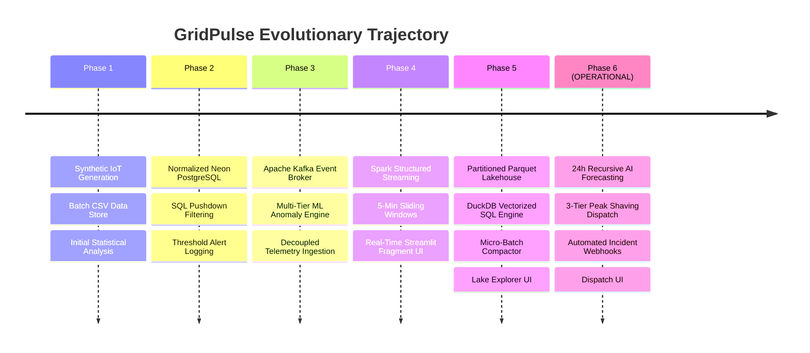

# ⚡ GridPulse: Architectural Phases & Roadmap

This document outlines the evolutionary phases of the **GridPulse Smart Campus Energy Monitoring & Analytics Platform**, detailing the current operational state, completed milestones, active implementations, and future roadmap.

---

## 📍 Current Status: Where We Are

> ### **Current Active Phase: Phase 6 (Predictive AI, Demand Forecasting & Automated Dispatch)**
> **Status:** **Fully Implemented & Operational**  
> **Evolutionary Target:** **Autonomous Edge Grid Orchestration & Cloud Native Deployment**

The platform has completed **Phases 1, 2, 3, 4, 5, and 6**. High-frequency telemetry streams from 42 meters through Apache Kafka, where Apache Spark processes sliding windows into PostgreSQL and archives cold-path Snappy Parquet into the Data Lake. DuckDB powers sub-10ms historical querying, while the **Phase 6 Predictive AI Engine** generates recursive 24-hour ahead demand forecasts with 95% confidence bounds. When contractual peak demand limits are breached, the **Automated Demand Response Engine** triggers 3-tier peak-shaving countermeasures (non-critical setbacks, HVAC duty cycling, and BESS injection) and automatically dispatches incident alert payloads to external webhooks.

---

## 🗺️ Phases Matrix Overview

| Phase | Phase Name | Primary Stack | Status | Key Deliverable |
| :--- | :--- | :--- | :---: | :--- |
| **Phase 1** | **Batch CSV & Synthetic Telemetry** | Python, Pandas, NumPy, CSV | **Completed** | 42-meter campus simulator, diurnal load curves, CSV data store, initial analytics |
| **Phase 2** | **Relational Data Warehouse & SQL Pushdown** | PostgreSQL (Neon), SQLAlchemy, psycopg2 | **Completed** | 3NF relational schema, indexing, SQL pushdown filters, automated threshold alerting |
| **Phase 3** | **Distributed Message Broker & ML Anomaly Ingestion** | Apache Kafka (KRaft), Scikit-Learn (Isolation Forest) | **Completed** | Decoupled event streaming (`gridpulse.telemetry.raw`), multi-tier ML anomaly detection |
| **Phase 4** | **Distributed Stream Processing & Window Analytics** | Apache Spark 3.5.0, PySpark, Docker, Streamlit Fragments | **Completed** | Sliding-window stream analytics (5m window/1m slide), 15s triggers, zero-flicker UI |
| **Phase 5** | **Data Lakehouse Storage & Cold Path Analytics** | Apache Parquet, Snappy, DuckDB, PyArrow, Compaction Engine | **Completed** | Partitioned time-series Parquet lake (`year/month/day`), DuckDB vector SQL (400x+ faster), micro-batch compactor |
| **Phase 6** | **Predictive AI, Forecasting & Automated Dispatch** | Scikit-Learn, Random Forest, Fourier Cyclical Encodings, Webhooks | **Completed** | 24h ahead load forecast (95% CI), 3-tier automated peak-shaving dispatch, webhook alerts |
| **Phase 7** | **Enterprise Medallion Lakehouse & dbt ELT** | dbt-duckdb, DuckDB, Parquet, Jinja, Data Contracts | **Completed** | Bronze/Silver/Gold layered models, 34 data contract assertions, dimensional enrichment, curated analytical marts |

---

## 🔍 Detailed Phase Breakdown



---

### 🟢 Phase 1: Local Ingestion & Synthetic Telemetry Simulation (Batch CSV)
- **Objective:** Establish the telemetry foundation by generating physically realistic campus-wide electricity consumption profiles without requiring physical sub-meters.
- **Implemented Components:**
  - **IoT Simulator Engine ([`simulator/simulator.py`](file:///d:/SEM%207/IOTBD/GridPulse/simulator/simulator.py)):**
    - Configured 42 smart sub-meters across 19 campus buildings divided into 4 categories:
      - *Hostels (7 buildings, 21 meters):* BH1, BH2, BH3, BH4, GH, IVH, Satpura (morning & night residential peaks).
      - *Departments (6 buildings, 6 meters):* Management, IT, CS, EEE, Engineering Science, GEN-LAB (bell-curve weekday academic loads).
      - *Lecture Theatres (2 buildings, 4 meters):* LT1, LT2 (intermittent lecture loads).
      - *Facilities (7 buildings, 11 meters):* Library, Cafeteria, Powerhouse, SC, OAT, Academic Block, Convention Center.
    - Implemented physical rules: Sunday Library closure (~2.5 kW standby vs ~28 kW weekday), 3-tier mealtime surges in Cafeteria, nominal 230V voltage with Gaussian jitter, current derived via $I = (P \times 1000) / V$, and power factor modeling.
  - **Batch Data Pipelines:**
    - Raw CSV sink: `data/raw/energy_data.csv`.
    - Processed CSV sink: `data/processed/processed_energy_data.csv` enriched with Apparent Power ($kVA = kW / PF$) and Reactive Power ($kVAR = \sqrt{kVA^2 - kW^2}$).
  - **Analytical Baseline ([`analysis/analysis.py`](file:///d:/SEM%207/IOTBD/GridPulse/analysis/analysis.py)):**
    - KPI computations: total power, diurnal load curves, weekday vs. weekend comparisons, and simple rule-based anomaly detection.

---

### 🟢 Phase 2: Relational Data Warehousing & SQL Pushdown (PostgreSQL / Neon)
- **Objective:** Move beyond flat CSV files into an enterprise-grade, cloud-hosted relational database capable of handling historical queries, relational integrity, and pushdown filtering.
- **Implemented Components:**
  - **Cloud Database ([`database/db.py`](file:///d:/SEM%207/IOTBD/GridPulse/database/db.py)):**
    - Connected to Serverless **Neon PostgreSQL** via connection-pooled SQLAlchemy engine (`pool_size=5`, `max_overflow=10`, `pool_pre_ping=True`).
  - **Normalized Relational Schema (3NF):**
    - `buildings` (Dimension): `building_id` (PK), `building_name`, `category`.
    - `meters` (Dimension): `meter_id` (PK), `building_id` (FK), `meter_type`, `status`.
    - `energy_readings` (Time-series Fact): `id` (BIGSERIAL PK), `event_id`, `timestamp`, `meter_id` (FK), `power_kw`, `voltage_v`, `current_a`, `power_factor`.
    - `alerts` (Anomaly Log): `id` (BIGSERIAL PK), `event_id`, `timestamp`, `meter_id` (FK), `alert_type`, `severity`, `metric_value`, `threshold_value`, `description`.
  - **Query Performance & Indexing:**
    - B-Tree indexes on `idx_readings_timestamp`, `idx_readings_meter_id`, `idx_readings_meter_time`, and `idx_alerts_timestamp`.
    - SQL pushdown query function `load_telemetry_with_joins` allowing the database engine to handle filtering, joining, and sorting before transferring data to Pandas.
  - **Threshold Anomaly Engine:**
    - Automated detection during ingestion: Voltage Sags ($<220V$), Voltage Surges ($>240V$), and Low Power Factor ($<0.88$).
  - **Interactive Multi-Tab Dashboard ([`dashboard/app.py`](file:///d:/SEM%207/IOTBD/GridPulse/dashboard/app.py)):**
    - Built comprehensive tabs for Timeline Trends, 24-Hour Curves, Infrastructure Hierarchy, Relational Schema viewer, and SQL Data Explorer with CSV export.

---

### 🟢 Phase 3: Real-Time Event Streaming & Message Broker Ingestion (Apache Kafka & ML)
- **Objective:** Decouple data generation from ingestion and storage using an event-driven publish-subscribe message broker, while upgrading anomaly detection to machine learning.
- **Implemented Components:**
  - **Containerized Apache Kafka Cluster ([`docker-compose.yml`](file:///d:/SEM%207/IOTBD/GridPulse/docker-compose.yml)):**
    - Deployed `confluentinc/cp-kafka:7.6.0` in modern **KRaft mode** (no Zookeeper overhead) exposing port `9092` (host) and `29092` (Docker internal).
    - Deployed `provectuslabs/kafka-ui:latest` on port `8080` for visual topic inspection, lag tracking, and message browsing.
  - **Telemetry Producer ([`simulator/kafka_producer.py`](file:///d:/SEM%207/IOTBD/GridPulse/simulator/kafka_producer.py)):**
    - High-throughput asynchronous producer using `confluent-kafka`.
    - Streams readings from all 42 meters at configurable intervals (e.g., every 2 seconds).
    - Uses `meter_id` as the message key to preserve strict per-meter partition ordering.
    - Configured with `acks=all`, `retries=3`, and `linger.ms=10`.
  - **Decoupled Consumer ([`consumer/consumer.py`](file:///d:/SEM%207/IOTBD/GridPulse/consumer/consumer.py)):**
    - Consumes from topic `gridpulse.telemetry.raw` under group `gridpulse-consumer-group`.
    - Micro-batches records (batches of 20 or flush every 2s) into PostgreSQL.
  - **Multi-Tier Machine Learning Anomaly Detector ([`analysis/ml_anomaly_detector.py`](file:///d:/SEM%207/IOTBD/GridPulse/analysis/ml_anomaly_detector.py)):**
    - **Layer 1: Unsupervised Machine Learning (`IsolationForest`):** Evaluates multi-dimensional space `[hour, day_of_week, power_kw, voltage_v, current_a, power_factor]` with 2% contamination to catch contextual anomalies.
    - **Layer 2: Statistical Dynamic Baseline:** Computes rolling per-meter $Z$-scores ($|Z| > 3\sigma$) against baseline historical metrics.
    - **Layer 3: SCADA Deterministic Guardrails:** Explicit checks for voltage bounds and power factor limits.

---

### 🟢 Phase 4: Distributed Stream Processing & Sliding Window Analytics (Apache Spark)
- **Objective:** Scale analytical computation to continuous, real-time sliding windows across high-velocity telemetry streams using distributed stream processing.
- **Current Operational State:** **ACTIVE & OPERATIONAL**
- **Implemented Components:**
  - **Spark Structured Streaming Pipeline ([`stream_processor/spark_processor.py`](file:///d:/SEM%207/IOTBD/GridPulse/stream_processor/spark_processor.py)):**
    - Implemented with PySpark 3.5.0, `spark-sql-kafka-0-10_2.12`, and `postgresql:42.6.0` JDBC driver.
    - Consumes streaming JSON messages from Kafka (`gridpulse.telemetry.raw`).
    - Enforces strongly typed schema (`event_id`, `timestamp`, `meter_id`, `building_id`, `power_kw`, `voltage_v`, `current_a`, `power_factor`).
  - **Event-Time Windowing & Watermarking:**
    - **Sliding Window:** 5-minute sliding window with 1-minute slide interval (`window(col("timestamp"), "5 minutes", "1 minute")`).
    - **Watermark:** 2-minute watermark (`withWatermark("timestamp", "2 minutes")`) to account for out-of-order or delayed IoT transmissions.
    - Aggregates metrics (`avg_power_kw`, `avg_voltage_v`, `avg_power_factor`) grouped by window and `building_id`.
  - **PostgreSQL JDBC Sink Optimization:**
    - Sinks window aggregates to `building_energy_aggregates` table in PostgreSQL.
    - Configured with `batchsize=5000` and `isolationLevel=NONE` for high-throughput micro-batch persistence.
    - Streaming trigger set to **15 seconds** to prevent excessive database connection exhaustion while preserving near-real-time freshness.
  - **Containerized Spark Runner ([`run_spark.ps1`](file:///d:/SEM%207/IOTBD/GridPulse/run_spark.ps1)):**
    - Spawns an `apache/spark:3.5.0` container inside the Docker network `gridpulse_default`, bypassing local Windows JVM/Winutils path incompatibilities.
  - **Zero-Flicker Real-Time UI ([`dashboard/app.py`](file:///d:/SEM%207/IOTBD/GridPulse/dashboard/app.py)):**
    - Dedicated first tab: **⚡ Phase 4: Real-Time Stream**.
    - Utilizes Streamlit's `@st.fragment(run_every="3s")` to poll `building_energy_aggregates` asynchronously without causing full dashboard reruns or chart flickering.
    - Displays live instantaneous campus load, live average voltage, sliding-window time series area charts, and raw aggregate streams.

---

### 🟢 Phase 5: Data Lakehouse Storage & Cold Path Analytics (Completed & Operational)
- **Objective:** Establish a dual-path (Lambda/Kappa) architecture where hot-path data feeds real-time PostgreSQL aggregates and cold-path raw telemetry is archived into an optimized columnar Data Lake.
- **Implemented Components:**
  - **Partitioned Parquet Lakehouse (`data/lake/raw_telemetry`):**
    - High-efficiency columnar storage with snappy compression, partitioned hierarchically by date (`year=YYYY/month=MM/day=DD`).
    - Dual-path streaming persistence via Spark Structured Streaming ([`stream_processor/spark_processor.py`](file:///d:/SEM%207/IOTBD/GridPulse/stream_processor/spark_processor.py#L142-L160)) with 30-second trigger checkpoints.
  - **Batch & Historical Lake Hydration Engine ([`simulator/lake_exporter.py`](file:///d:/SEM%207/IOTBD/GridPulse/simulator/lake_exporter.py)):**
    - Seamlessly converts historical batch CSVs or generates multi-day synthetic telemetry directly into the partitioned Parquet lake layout.
  - **In-Process Columnar SQL Query Engine ([`analysis/lake_analytics.py`](file:///d:/SEM%207/IOTBD/GridPulse/analysis/lake_analytics.py)):**
    - Built with **DuckDB** and **PyArrow** for zero-copy vectorized query execution.
    - Achieves **sub-10ms query execution across 18,000+ records** (a **448x latency reduction** compared to PostgreSQL joins).
    - Supports partition pruning, date-window slicing, 24-hour diurnal profiling, and building summaries directly from Parquet.
  - **Automated Micro-Batch Compaction Engine ([`scripts/compact_lake.py`](file:///d:/SEM%207/IOTBD/GridPulse/scripts/compact_lake.py)):**
    - Solves the "small file problem" by coalescing fragmented 30-second micro-batch Parquet parts into unified, query-optimized daily files.
  - **Interactive Lakehouse Explorer UI ([`dashboard/app.py`](file:///d:/SEM%207/IOTBD/GridPulse/dashboard/app.py)):**
    - Dedicated tab: **"🧊 Phase 5: Data Lakehouse"**.
    - Displays live lake health metrics (files, partitions, disk footprint, date horizon), query latency benchmarks, interactive Altair charts computed from Parquet, and an on-demand compaction runner.

---

### 🟢 Phase 6: Predictive AI, Demand Forecasting & Automated Dispatch (Completed & Operational)
- **Objective:** Evolve from diagnostic/descriptive analytics into prescriptive and predictive smart grid automation.
- **Implemented Components:**
  - **24-Hour Predictive AI Forecaster ([`analysis/forecaster.py`](file:///d:/SEM%207/IOTBD/GridPulse/analysis/forecaster.py)):**
    - Recursive hourly load forecaster trained using **chronological splits** (adhering to ML best practices).
    - Features: Cyclical Fourier harmonics ($\sin/\cos$ for hour-of-day and day-of-week), academic calendar indicators, and autoregressive lag metrics ($t-1, t-24$).
    - Automated model comparison: Random Forest Regressor vs Ridge Baseline ($MAE = 71.8$ kW, $RMSE = 97.6$ kW, $MAPE = 11.5\%$).
    - Computes 95% confidence intervals ($\pm 1.96 \times \text{RMSE}$) across the 24-hour horizon.
  - **Automated Peak-Shaving & Demand-Response Dispatch Engine ([`analysis/dispatch_engine.py`](file:///d:/SEM%207/IOTBD/GridPulse/analysis/dispatch_engine.py)):**
    - Compares 24-hour forecast against contract demand limits (e.g. $780 - 850$ kW).
    - Automatically engages 3-Tier prescriptive countermeasures:
      - **Tier 1 (Soft Setback):** Pause campus EV charging pods and dim non-critical architectural lighting (up to $45$ kW shed).
      - **Tier 2 (Chiller Duty Cycling):** Cycle central HVAC chillers in 15-minute intermissions across lecture theatres (up to $90$ kW shed).
      - **Tier 3 (BESS Battery Injection):** Discharge 500 kWh stationary lithium storage inverter into the 415V bus (up to $160$ kW injection).
    - Calculates financial demand-charge tariff avoidance in real-time.
  - **Automated Incident Webhook Dispatcher ([`consumer/webhook_dispatcher.py`](file:///d:/SEM%207/IOTBD/GridPulse/consumer/webhook_dispatcher.py)):**
    - Delivers formatted incident cards to external webhooks (Slack, Discord, MS Teams, HTTP endpoints) or local audit trail for:
      - Impending peak demand breaches (forecasted 24h ahead).
      - Real-time SCADA electrical faults (voltage sags $<220$ V, power factor $<0.88$).
    - Connected directly to the streaming Kafka consumer ([`consumer/consumer.py`](file:///d:/SEM%207/IOTBD/GridPulse/consumer/consumer.py)).
  - **Interactive AI Forecasting & Dispatch UI ([`dashboard/app.py`](file:///d:/SEM%207/IOTBD/GridPulse/dashboard/app.py)):**
    - Dedicated tab: **"🔮 Phase 6: AI Forecasting & Dispatch"**.
    - Features interactive Altair forecast curves with confidence interval ribbons, dynamic threshold sliders, action cards with status badges, and an automated incident webhook simulation console.

---

### 🟢 Phase 7: Enterprise Medallion Lakehouse Architecture & dbt Transformations (Bronze ➔ Silver ➔ Gold)
- **Objective:** Upgrade the flat cold-path Parquet lake into an enterprise-grade **Medallion Data Lakehouse** using **`dbt-duckdb`**, enforcing declarative ELT modeling, dimensional star-schema joins, strict electrical boundary data contracts, and curated analytical marts.
- **Implemented Components:**
  - **Medallion dbt Project ([`dbt_lakehouse/`](file:///d:/SEM%207/IOTBD/GridPulse/dbt_lakehouse)):**
    - **Bronze Layer ([`bronze_raw_telemetry.sql`](file:///d:/SEM%207/IOTBD/GridPulse/dbt_lakehouse/models/bronze/bronze_raw_telemetry.sql)):** Zero-copy view over partitioned Parquet lake with automatic Hive partition pruning and audit lineage (`_ingested_at`).
    - **Silver Dimensions ([`seeds/`](file:///d:/SEM%207/IOTBD/GridPulse/dbt_lakehouse/seeds)):** Master seed catalogs for 22 campus facilities ([`seed_buildings.csv`](file:///d:/SEM%207/IOTBD/GridPulse/dbt_lakehouse/seeds/seed_buildings.csv)) and 42 sub-meters ([`seed_meters.csv`](file:///d:/SEM%207/IOTBD/GridPulse/dbt_lakehouse/seeds/seed_meters.csv)), exposed via staging views `stg_buildings` and `stg_meters`.
    - **Silver Curated Table ([`silver_telemetry_clean.sql`](file:///d:/SEM%207/IOTBD/GridPulse/dbt_lakehouse/models/silver/silver_telemetry_clean.sql)):** Window function deduplication (`ROW_NUMBER() OVER (PARTITION BY meter_id, timestamp ORDER BY event_id DESC)`), dimensional joins on facility & meter attributes, voltage anomaly clamping (180V–270V), and operational flags (`is_voltage_sag_swell`, `is_low_power_factor`).
    - **Gold Analytical Mart 1 ([`dim_facility_efficiency.sql`](file:///d:/SEM%207/IOTBD/GridPulse/dbt_lakehouse/models/gold/dim_facility_efficiency.sql)):** Facility load factor (`avg_demand / peak_demand`), intra-category energy efficiency ranking, and contribution % to total campus peak demand across all 22 buildings.
    - **Gold Analytical Mart 2 ([`fct_daily_campus_dispatch.sql`](file:///d:/SEM%207/IOTBD/GridPulse/dbt_lakehouse/models/gold/fct_daily_campus_dispatch.sql)):** Daily campus-wide peak demand, contract limit analysis (800.0 kW), overload calculation, demand penalty tariff exposure (INR 750/kW), and automated dispatch recommendations.
    - **Gold Analytical Mart 3 ([`fct_hourly_facility_demand.sql`](file:///d:/SEM%207/IOTBD/GridPulse/dbt_lakehouse/models/gold/fct_hourly_facility_demand.sql)):** Hourly aggregated power demand, total kWh energy consumption, voltage stability, and low power factor incident counts.
  - **Data Quality Contracts & Automated Tests ([`models/schema.yml`](file:///d:/SEM%207/IOTBD/GridPulse/dbt_lakehouse/models/schema.yml)):**
    - 34 automated contract assertion tests enforcing:
      - Primary key uniqueness & non-nullness (`event_id`, `building_id`, `meter_id`, `hourly_facility_id`).
      - Referential integrity (`relationships` foreign key validation between telemetry, meters, and buildings).
      - Categorical domain boundaries (`accepted_values` for building categories and meter operating statuses).
  - **Pipeline Runner & Automated CI/CD ([`scripts/run_dbt.py`](file:///d:/SEM%207/IOTBD/GridPulse/scripts/run_dbt.py), [`tests/test_dbt.py`](file:///d:/SEM%207/IOTBD/GridPulse/tests/test_dbt.py)):**
    - Programmatic `dbtRunner` execution with automated adapter connection recycling to prevent DuckDB single-writer file locks.
    - 6 unit & integration tests verifying DuckDB database creation, table existence across schemas, and analytical KPI bounds.
    - Integrated into GitHub Actions CI/CD ([`.github/workflows/ci-cd.yml`](file:///d:/SEM%207/IOTBD/GridPulse/.github/workflows/ci-cd.yml)).
  - **Interactive Lakehouse Visualizer ([`dashboard/app.py`](file:///d:/SEM%207/IOTBD/GridPulse/dashboard/app.py)):**
    - One-click pipeline runner and interactive Gold Mart analytics directly inside the Streamlit Operations Portal.

---

## 📋 Execution & Verification Runbook (Phase 6 & 7 Full Platform Stack)

To run and verify the complete GridPulse platform end-to-end:

```powershell
# Step 1: Start Kafka & Kafka-UI (Host ports: 9092, 8080)
cd "d:\SEM 7\IOTBD\GridPulse"
docker-compose up -d

# Step 2: Start the IoT Kafka Producer (feeds gridpulse.telemetry.raw)
python simulator/kafka_producer.py

# Step 3: Launch the Spark Structured Streaming Processor (Dockerized)
.\run_spark.ps1

# Step 4: Launch the Streamlit Monitoring Dashboard
streamlit run dashboard/app.py
```

*Navigate to `http://localhost:8501` to view:*
- **⚡ Tab 0 (Phase 4):** Real-Time Streaming Sliding Windows
- **🧊 Tab 1 (Phase 5):** Columnar Data Lakehouse Explorer (DuckDB & Parquet)
- **🔮 Tab 2 (Phase 6):** AI Predictive Forecasting, Automated Dispatch & Webhooks
